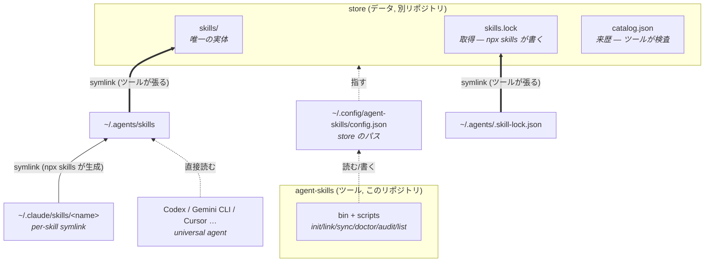

# Architecture

## 問題

スキルの実体が散在していると、「自分のスキルがどこにあるか」「3rd party を何のバージョンで
入れたか」が追跡できず、新しいマシンで再現できない。**store** リポジトリを唯一の canonical
source にして、その両方を解決する。

## ツール / データ分離

コマンド (このリポジトリ) と スキルデータ (store リポジトリ) は別々の git リポジトリにする。
chezmoi / yadm と同じ構図で、ツールは誰でも使え、データは各自のもの。

- ツールは操作対象の store を `~/.config/agent-skills/config.json`（`init`/`link` が書く）から
  読む。`AGENT_SKILLS_STORE` 環境変数で上書き可。
- 以降この文書で「store」と書くのはデータリポジトリを指す。`catalog.json` / `skills.lock` /
  `skills/` はすべて store の持ち物で、ツールはそれらを外から検査・配線する。

## 設計



太線の 2 本がツールの持ち物 (`~/.agents/` を store へ向ける)。`catalog.json` に `~/.agents/`
からの矢印が無いのは、参照されない store 専用ファイルだからで、欠落ではない。

自前で管理するのは config 1 つと `~/.agents/` 配下の **2 本の symlink だけ**。その下、各エージェント
へのファンアウトは `skills` CLI の責務であり、再実装しない。

### なぜ取得ロジックを自作しないか

`skills` CLI ([vercel-labs/skills](https://github.com/vercel-labs/skills)) が既に持っている:

- GitHub からの取得、`skillFolderHash` によるバージョン固定
- 70 以上のエージェントのインストール先レジストリ
- symlink によるファンアウト

`~/.agents/skills` はこの CLI にとっての canonical store そのもの (`dist/cli.mjs`):

```js
function getCanonicalSkillsDir(global, cwd) {
  return join(global ? homedir() : cwd, ".agents", "skills");
}
```

つまり `~/.agents/skills` を store へ向けるだけで、CLI が書き込むすべてが自動的に store の
版管理下に入る。取得も配布も書く必要がない。

### universal agent

CLI はエージェントを 2 種類に分ける:

```js
function isUniversalAgent(type) {
  return agents[type].skillsDir === ".agents/skills";
}
```

- **universal** (Codex / Gemini CLI / Cursor / Cline / Amp …) — canonical store を直接読む。
  専用ディレクトリは空のままでよい
- **非 universal** (Claude Code — `skillsDir: ".claude/skills"`) — `~/.claude/skills/<name>`
  に per-skill symlink が張られる

`agent-skills doctor` はこの区別を踏まえて判定する。Codex の `~/.codex/skills` が空でも正常。

## 落とし穴: 単一エージェント指定は copy モードになる

これが本設計で唯一の危険な挙動。`dist/cli.mjs`:

```js
let installMode = options.copy ? "copy" : "symlink";
const uniqueDirs = new Set(targetAgents.map(a => agents[a].skillsDir));
if (!options.copy && !options.yes && uniqueDirs.size > 1) {
  /* symlink / copy を対話で選ばせる */
} else if (uniqueDirs.size <= 1) {
  installMode = "copy";       // ← ここ
}
```

インストール先の `skillsDir` が 1 種類しかないと、CLI は**問答無用で copy モードに落ちる**。
copy モードでは canonical store を経由せず、エージェントのディレクトリへ実体が直接コピーされる:

```bash
# NG — ~/.claude/skills/foo に実ディレクトリがコピーされ、このリポジトリの管理外になる
npx skills add owner/repo -g -a claude-code -y

# OK — ~/.agents/skills/foo (= このリポジトリ) に実体が入り、Claude Code には symlink が張られる
npx skills add owner/repo -g -a claude-code -a codex -y
```

`scripts/sync.ts` は `skills.lock` の `lastSelectedAgents` を全部 `-a` で渡すことでこれを回避する
(`scripts/lib/paths.ts` の `targetAgents()`)。手で `skills add` を叩くときも同じ注意が要る。

`agent-skills doctor` はエージェントディレクトリ内の実ディレクトリを検出するので、
copy モードで入ってしまった場合は事後的に気づける。

## 3rd party を非コミットにする仕組み

`skills.lock` に載っている名前 = 3rd party、という不変条件を置く。`scripts/sync.ts` が
その名前から `skills/.gitignore` の管理ブロックを再生成する:

```text
# --- managed by scripts/sync.ts (do not edit) ---
/find-skills/
/freee-api-skill/
# --- end managed ---
```

自作スキルは lock に載らないので、自動的に git の対象として残る。gitignore を手で
管理する必要がなく、「lock に足したのに ignore し忘れた」が起きない。

## catalog.json: 来歴を画一的にする層

配布された zip、社内共有、既に消えたリポジトリからの写し — 自作ではないが `npx skills`
では取得できないものがある。上の不変条件だけではこれを表現できない。「lock に載っていない」
= 自作、と扱われてしまう。

そして「作者は誰か」「元になった note 記事はどれか」は、**どの種類のスキルにも等しく
存在する情報なのに、置き場所がどこにも無かった**。

### 関心事が 2 つ混ざっている

```text
                    復元 (restore)              来歴 (provenance)
                    ─────────────────           ─────────────────
  問い              壊れたら何で戻すか            誰が書いたか / 何を読めばいいか
  種類による違い      本質的にある                 無い
  真実の在り処        skills.lock (CLI が書く)     catalog.json (このリポジトリが書く)
  画一化             できない                     すべき
```

復元は画一化**できない**。git で戻すものとネットワークから取るものは、本質的に別の操作だ。
来歴は画一化**すべき**。自作スキルにも参考にした記事はあるし、remote スキルにも作者がいる。

そこで `catalog.json` が全スキルを同じ形式で持ち、`kind` (`own` / `remote` / `vendored`)
だけが復元方法を指す。`scripts/doctor.ts` の出力が画一化の結果になっている:

```text
  ok    create-notion-db (own, ken-ty)
  ok    find-skills (remote, vercel-labs)
  ok    some-skill (vendored, 社内 platform チーム)
```

### なぜ skills.lock に相乗りしないか

`skills.lock` は `~/.agents/.skill-lock.json` の実体であり、`skills` CLI が自由に
読み書きする。そこに独自エントリを足すと:

- CLI が知らない `source` を解決しようとして失敗しうる
- CLI の書き込みで消える可能性がある

そもそも lock は remote しか知らないので、全スキルの台帳にはなれない。`catalog.json` は
このリポジトリだけが読む別ファイルとして分離してある。

### なぜ自作スキルに疑似 URL を振らないか

「全部 URL を持たせれば画一的になる」— 自作を `../skills/.` のような相対パスで表す案は
一見きれいだが、採らなかった。誰も解決できない URL は `agent-skills sync` で取得できるという
誤解を招く。`kind` は同じことを、嘘をつかずに表す。

**画一化すべきは形式であって、意味ではない。** 全エントリが同じフィールドを持つのが
画一性であり、意味の違う値を同じ欄に押し込むのはその逆になる。

### gitignore は lock から生成する

`catalog.json` の `kind: remote` ではなく `skills.lock` を真実として使う
(`ignorableNames()`)。lock は CLI が書くので常に正しいが、catalog は手書きなのでずれうる。
ずれたときに壊れ方が非対称なのが理由だ:

- catalog を信じて誤って ignore → git にしか無いスキルが消える (**復旧不能**)
- lock を信じて ignore し損ねる → 3rd party が 1 つコミットされる (無害)

安全な側に倒し、ずれ自体は `doctor` が BAD として報告する。

### kind と lock は必ず一致させる

`kind: remote` なのに lock に無ければ取得手段が無く、`own` / `vendored` なのに lock に
あれば ignore される。どちらも実害があるので `sync` は gitignore を書く前に中断し、
`doctor` は BAD を出す。自動でどちらかに寄せる実装にはしていない — 取得元が実在するかは
人間にしか判断できない。

### origin は vendored だけ必須

`own` は git 履歴、`remote` は `sourceUrl` から出自を辿れるが、vendored にはどちらも無い。
散文で残さないと 1 年後に来歴を再構成できないため、ここだけ `doctor` が空を BAD にする。

## `link.ts` の安全設計

`$HOME` を書き換えるため:

- **削除しない** — 邪魔な実ディレクトリ / ファイルは `.bak-<timestamp>` にリネームして残す
- **`--dry-run`** — 実行前に全操作を表示できる
- **冪等** — 正しい symlink が既にあれば何もしない
- **別の store を指す symlink は張り替える** — `link <dir>` は「この store を指す」という明示の
  指示なので repoint する。symlink は実体を持たないので安全（実ディレクトリは上の退避ルール）。
  張り替え前の向き先はログに出す
