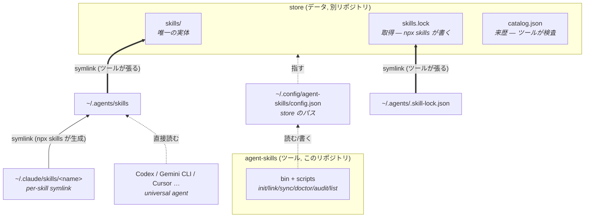
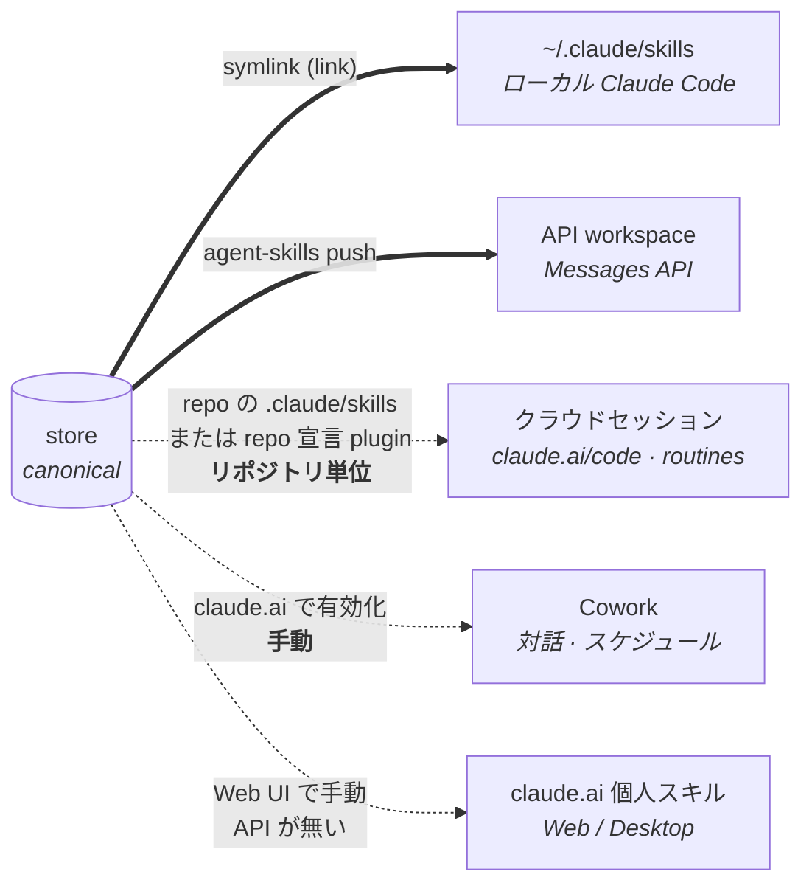

# Architecture

## 問題

スキルの実体が散在していると、「自分のスキルがどこにあるか」「3rd party を何のバージョンで
入れたか」が追跡できず、新しいマシンで再現できない。**store** リポジトリを唯一の canonical
source にして、その両方を解決する。

## ツール / データ分離

コマンド (このリポジトリ) と スキルデータ (store リポジトリ) は別々の git リポジトリにする。
chezmoi / yadm と同じ構図で、ツールは誰でも使え、データは各自のもの。

- ツールは操作対象の store を `~/.config/agent-skills/config.json`（`init`/`link` が書く）から
  読む。`AGENT_SKILLS_STORE` 環境変数で上書き可。
- 以降この文書で「store」と書くのはデータリポジトリを指す。`catalog.json` / `skills.lock` /
  `skills/` はすべて store の持ち物で、ツールはそれらを外から検査・配線する。

### 3 層目: 配布面（`agent-skills-share`）

store のスキルを 1 本だけ外部の人に渡すための public リポジトリ
（[#24](https://github.com/ken-ty/agent-skills/issues/24)）。手順は store の
`share-agent-skill` スキルにある。

```text
agent-skills ──操作──▶ agent-skills-store ──切り出し──▶ agent-skills-share ──▶ 他人
```

**依存は一方向で、逆向きの参照が 1 つも無いことが要件。**

- **share は store を知らない。** 置いてあるのは `<name>/SKILL.md` + `references/` だけで、
  `catalog.json` も `skills.lock` も無い。受け取る側に `agent-skills` は要らない
- **store は share を知らない。** `catalog.json` に「共有中」は書かない。それは出自ではなく
  **配布状態**であり、書いた瞬間に SSOT が外部配布の都合を抱え込む
- **切り出しは同期ではない。** 一方向のコピー。恒久共有の更新は「もう一度コピーする」であって、
  差分追跡ではない

**配布面はサーフェスではない。** 5 サーフェスは「自分のスキルがどこで動くか」を数えたもので、
これは「他人に渡す」。`doctor` の surfaces セクションにも出さない。

#### `share` は 1 回の操作であって、管理機能ではない

`agent-skills share <name>` がするのは「切り出す → push → URL を返す」だけ。呼ぶたびに完結し、
呼んだ記録をどこにも残さない。恒久共有の更新も、同じコマンドをもう一度実行して上書きするだけで、
差分追跡ではない。

一時共有は clone すらしない ── **orphan に持ち込む履歴は存在しない**ので、空ディレクトリで
`git init` して push するのが最短かつ、他の共有から独立していることの保証にもなる。

配布先（`shareRepo`）は store ではなく `~/.config/agent-skills/config.json` に置く。store に
書くと「自分のスキルがどこへ配られるか」を store が知ることになり、一方向の依存が崩れる。

#### state を持たない

一時共有の期限は**ブランチ名に埋める**（`share-<name>-<expiry>`）。ローカルに台帳を置くと
GitHub 側のブランチ一覧と二重帳簿になり、「どちらが正しいか」を判定する仕組みがさらに要る。
真実は GitHub にあるので、そこに聞けばよい:

```bash
gh api repos/ken-ty/agent-skills-share/branches --jq '.[].name'
```

同じ理由で `doctor` に共有の検査を足さない。`doctor` はこのマシンの配線を見る道具であり、
外部リポジトリの状態は管轄外。

#### 期限切れの掃除は share 側の CI がやる。ツールは持たない

ブランチ名に埋めた期限を**読み返す主体**は、`agent-skills` ではなく
`agent-skills-share` の scheduled workflow（`.github/workflows/gc-expired-shares.yml`）。

ツール側に `share --gc` を持たせない理由は、**呼ばれないと走らない**から。掃除が要るのは
「共有したまま忘れたとき」で、それはツールを起動しないときと同じ状況を指す。CI なら
本人が忘れても走る。

**store 側に置くのも却下した。** cross-repo になるので PAT が要り（`GITHUB_TOKEN` は
自リポジトリスコープ）、なにより「store は share を知らない」が壊れる。掃除に必要なのは
ブランチ名だけで store の中身は 1 バイトも要らないのだから、データの無い側へ権限だけ
持っていくことになる。share 側なら `GITHUB_TOKEN` で完結し、シークレットはゼロ。

**掃除は衛生であって、執行ではない。** 消しても回収にはならない（上記の通り SHA では
読めるし、相手のコピーは相手のもの）。この CI が閉じるのは install 経路だけで、
**「期限が来れば消える」を安全性の根拠にしてはいけない。** 落ちても被害が出ない前提だから、
権限も作りも最小にしてある。

そのため、次の 2 つは仕様として飲んでいる:

- **`on: push` では起動しない。** 一時共有は orphan ブランチで `.github/` を含まないため、
  push イベントのワークフロー解決（push された ref 上のファイルを読む）に引っかからない。
  `schedule` と `workflow_dispatch` はデフォルトブランチから走るので、この 2 つだけを使う
- **60 日の非活動で自動的に止まりうる。** GitHub は public リポジトリの scheduled workflow を
  60 日の非活動で無効化する。share は共有したときしか push されないので現実に起きるが、
  通知は来るし復旧は手動実行 1 回。残るのは自分が公開すると決めたスキル 1 本にすぎない

判断の背景と実装上の注意（デフォルトブランチの除外、末尾連番 `-2` の拾い方、期限当日は
生かすこと、`--paginate`）は workflow のヘッダコメントに書いてある。

#### 一時共有が提供するのは「期限」であって「秘匿」ではない

public リポジトリのブランチは誰でも列挙できる。また、ブランチを削除しても
**commit SHA を控えた人は `tree/<sha>/` で読み続けられる**（GitHub が unreachable commit を
しばらく保持するため）。撤回が閉じるのは install 経路だけで、消去ではない。

したがって渡す URL には**必ずブランチ名を使う**。SHA は `npx skills` の
`git clone --depth 1 --branch <ref>` が受け付けないので install できず、しかも撤回が効かない。
見せたくないものは private リポジトリ + collaborator 招待の領域で、この仕組みの対象外。

## 設計



太線の 2 本がツールの持ち物 (`~/.agents/` を store へ向ける)。`catalog.json` に `~/.agents/`
からの矢印が無いのは、参照されない store 専用ファイルだからで、欠落ではない。

自前で管理するのは config 1 つと `~/.agents/` 配下の **2 本の symlink**、そして各エージェントへの
**ファンアウト**（`agent-skills distribute`）。

ファンアウトは当初 `skills` CLI に任せていたが、それでは **CLI が入れたスキルしか配られない**。
own と vendored は誰も張らないので、手で `ln -s` し忘れると store には在るのにエージェントからは
見えない、という無言の欠落になる。配布先は `~/.config/agent-skills/config.json` の `agents` で
明示的に opt-in する（既定は `claude-code` のみ）。取得は今も `skills` CLI に委譲する。

## 配布先は 5 サーフェスあり、同期しない。届くのは 2 つだけ

上図は**ローカルのファイルシステム系統**だけを描いている。Anthropic のスキル置き場は実際には 5 つあり、
[公式ドキュメントが「サーフェス間で自動同期しない」と明記](https://platform.claude.com/docs/en/agents-and-tools/agent-skills/overview.md#cross-surface-availability)している。



実線 2 本だけがツールの管轄で、自動で反映される。**したがってこのツールの SSOT が意味するのは
「ローカル Claude Code + API ワークスペース」までである。** 破線 3 本は届かない:

- **クラウドセッション** (claude.ai/code / routines) は Anthropic 側のマシンで動き、このマシンの
  `~/.claude/skills` を読まない。届けるには clone されるリポジトリの `.claude/skills` にコミットするか、
  そのリポジトリの `.claude/settings.json` でプラグインを宣言する。**ユーザ設定で有効化しただけの
  プラグインは転送されない**ため、どちらもリポジトリ単位の作業になり、global store の代替にはならない
- **Cowork** は対話・スケジュールとも **claude.ai アカウントで有効化したスキル**をセッション開始時に
  同期する。リポジトリにコミットしてもプラグインを宣言しても届かない
- **claude.ai 個人スキル**は API が存在しないため手動のみ

出典: [skills in Cowork and cloud sessions](https://code.claude.com/docs/en/skills#skills-in-cowork-and-cloud-sessions)。

`agent-skills push` が成功しても claude.ai には何も入らず、その旨を push 自身が出力の最後に必ず書く
（README に隠さない）。`doctor` の `surfaces` セクションが 5 サーフェスの状態を毎回報告するので、
「store が green ＝ どこも最新」と誤読されない。

### なぜ plugin / marketplace 化を採らないか

一貫性を目的に据えると（[#10](https://github.com/ken-ty/agent-skills/issues/10)）、届かない 3 本を
どう塞ぐかが論点になる。プラグイン化は候補だったが、採らないと決めた:

- 塞げるのは**クラウドセッションだけ**で、しかもリポジトリごとに宣言が要る。Cowork と claude.ai は
  プラグインでも塞がらないため、「どこでも同じスキル」という目標には構造的に届かない
- store は private であり、[private marketplace は背景自動更新が HTTPS 認証できず再 clone に
  フォールバックする](https://code.claude.com/docs/en/plugin-marketplaces#private-repositories)という
  既知の不安定さを抱える（`CLAUDE_CODE_PLUGIN_KEEP_MARKETPLACE_ON_FAILURE=1` 等の回避策が要る）
- 対して store を marketplace 構造（`.claude-plugin/marketplace.json` + `plugins/<name>/`）へ
  組み替えるコストは大きい

したがって**看板を下ろす方を選ぶ**。届かないサーフェスは「届かない」と書き、`doctor` が毎回それを
報告する。塞いだふりをしない。

### なぜ取得ロジックを自作しないか

`skills` CLI ([vercel-labs/skills](https://github.com/vercel-labs/skills)) が既に持っている:

- GitHub からの取得、`skillFolderHash` によるバージョン固定
- 70 以上のエージェントのインストール先レジストリ
- 自分が入れたスキルの symlink 配置

ファンアウトだけは引き取った。CLI が張るのは CLI 自身が入れた `remote` のスキルに限られ、
own / vendored は対象外だからで、取得ロジックそのものは今も委譲している。

`~/.agents/skills` はこの CLI にとっての canonical store そのもの (`dist/cli.mjs`):

```js
function getCanonicalSkillsDir(global, cwd) {
  return join(global ? homedir() : cwd, ".agents", "skills");
}
```

つまり `~/.agents/skills` を store へ向けるだけで、CLI が書き込むすべてが自動的に store の
版管理下に入る。取得も配布も書く必要がない。

### universal agent

CLI はエージェントを 2 種類に分ける:

```js
function isUniversalAgent(type) {
  return agents[type].skillsDir === ".agents/skills";
}
```

- **universal** (Codex / Gemini CLI / Cursor / Cline / Amp …) — canonical store を直接読む。
  専用ディレクトリは空のままでよい
- **非 universal** (Claude Code — `skillsDir: ".claude/skills"`) — `~/.claude/skills/<name>`
  に per-skill symlink が張られる

`agent-skills doctor` はこの区別を踏まえて判定する。Codex の `~/.codex/skills` が空でも正常。

## 落とし穴: 単一エージェント指定は copy モードになる

これが本設計で唯一の危険な挙動。`dist/cli.mjs`:

```js
let installMode = options.copy ? "copy" : "symlink";
const uniqueDirs = new Set(targetAgents.map(a => agents[a].skillsDir));
if (!options.copy && !options.yes && uniqueDirs.size > 1) {
  /* symlink / copy を対話で選ばせる */
} else if (uniqueDirs.size <= 1) {
  installMode = "copy";       // ← ここ
}
```

インストール先の `skillsDir` が 1 種類しかないと、CLI は**問答無用で copy モードに落ちる**。
copy モードでは canonical store を経由せず、エージェントのディレクトリへ実体が直接コピーされる:

```bash
# NG — ~/.claude/skills/foo に実ディレクトリがコピーされ、このリポジトリの管理外になる
npx skills add owner/repo -g -a claude-code -y

# OK — ~/.agents/skills/foo (= このリポジトリ) に実体が入り、Claude Code には symlink が張られる
npx skills add owner/repo -g -a claude-code -a codex -y
```

`scripts/sync.ts` は `skills.lock` の `lastSelectedAgents` を全部 `-a` で渡すことでこれを回避する
(`scripts/lib/paths.ts` の `targetAgents()`)。手で `skills add` を叩くときも同じ注意が要る。

`agent-skills doctor` はエージェントディレクトリ内の実ディレクトリを検出するので、
copy モードで入ってしまった場合は事後的に気づける。

## 3rd party を非コミットにする仕組み

`skills.lock` に載っている名前 = 3rd party、という不変条件を置く。`scripts/sync.ts` が
その名前から `skills/.gitignore` の管理ブロックを再生成する:

```text
# --- managed by scripts/sync.ts (do not edit) ---
/find-skills/
/freee-api-skill/
# --- end managed ---
```

自作スキルは lock に載らないので、自動的に git の対象として残る。gitignore を手で
管理する必要がなく、「lock に足したのに ignore し忘れた」が起きない。

### gitignore には穴がある — `sync` 前の `git add -A`

`skills/.gitignore` を書くのは `sync` なので、`npx skills add` から次の `sync` までの間、
新しい remote 実体は**まだ ignore されていない**。この窓で `git add -A` すると実体が index に入る。

厄介なのは、一度 track された path には **.gitignore が効かなくなる**ことだ。あとから `sync` が
ignore リストを書き直しても手遅れで、他人のスキルの写しが store に居座り続ける。しかも
「git がそれを保持している」という記録はどこにも残らない。

塞ぐ手段が無いので（`npx skills` の実行タイミングは制御できない）、`doctor` が
`git ls-files -- skills/<remote>` で追跡状態を直接見て BAD にする。commit の内容そのものなので
`--repo` モード＝ pre-commit でも走る — **commit こそが被害の発生点**だからだ。

## catalog.json: 来歴を画一的にする層

配布された zip、社内共有、既に消えたリポジトリからの写し — 自作ではないが `npx skills`
では取得できないものがある。上の不変条件だけではこれを表現できない。「lock に載っていない」
= 自作、と扱われてしまう。

そして「作者は誰か」「元になった note 記事はどれか」は、**どの種類のスキルにも等しく
存在する情報なのに、置き場所がどこにも無かった**。

### 関心事が 2 つ混ざっている

```text
                    復元 (restore)              来歴 (provenance)
                    ─────────────────           ─────────────────
  問い              壊れたら何で戻すか            誰が書いたか / 何を読めばいいか
  種類による違い      本質的にある                 無い
  真実の在り処        skills.lock (CLI が書く)     catalog.json (このリポジトリが書く)
  画一化             できない                     すべき
```

復元は画一化**できない**。git で戻すものとネットワークから取るものは、本質的に別の操作だ。
来歴は画一化**すべき**。自作スキルにも参考にした記事はあるし、remote スキルにも作者がいる。

そこで `catalog.json` が全スキルを同じ形式で持ち、`kind` (`own` / `remote` / `vendored`)
だけが復元方法を指す。`scripts/doctor.ts` の出力が画一化の結果になっている:

```text
  ok    create-notion-db (own, ken-ty)
  ok    find-skills (remote, vercel-labs)
  ok    some-skill (vendored, 社内 platform チーム)
```

### なぜ skills.lock に相乗りしないか

`skills.lock` は `~/.agents/.skill-lock.json` の実体であり、`skills` CLI が自由に
読み書きする。そこに独自エントリを足すと:

- CLI が知らない `source` を解決しようとして失敗しうる
- CLI の書き込みで消える可能性がある

そもそも lock は remote しか知らないので、全スキルの台帳にはなれない。`catalog.json` は
このリポジトリだけが読む別ファイルとして分離してある。

### なぜ自作スキルに疑似 URL を振らないか

「全部 URL を持たせれば画一的になる」— 自作を `../skills/.` のような相対パスで表す案は
一見きれいだが、採らなかった。誰も解決できない URL は `agent-skills sync` で取得できるという
誤解を招く。`kind` は同じことを、嘘をつかずに表す。

**画一化すべきは形式であって、意味ではない。** 全エントリが同じフィールドを持つのが
画一性であり、意味の違う値を同じ欄に押し込むのはその逆になる。

### gitignore は lock から生成する

`catalog.json` の `kind: remote` ではなく `skills.lock` を真実として使う
(`ignorableNames()`)。lock は CLI が書くので常に正しいが、catalog は手書きなのでずれうる。
ずれたときに壊れ方が非対称なのが理由だ:

- catalog を信じて誤って ignore → git にしか無いスキルが消える (**復旧不能**)
- lock を信じて ignore し損ねる → 3rd party が 1 つコミットされる (無害)

安全な側に倒し、ずれ自体は `doctor` が BAD として報告する。

### kind と lock は必ず一致させる

`kind: remote` なのに lock に無ければ取得手段が無く、`own` / `vendored` なのに lock に
あれば ignore される。どちらも実害があるので `sync` は gitignore を書く前に中断し、
`doctor` は BAD を出す。自動でどちらかに寄せる実装にはしていない — 取得元が実在するかは
人間にしか判断できない。

### origin は vendored だけ必須

`own` は git 履歴、`remote` は `sourceUrl` から出自を辿れるが、vendored にはどちらも無い。
散文で残さないと 1 年後に来歴を再構成できないため、ここだけ `doctor` が空を BAD にする。

## `link.ts` の安全設計

`$HOME` を書き換えるため:

- **削除しない** — 邪魔な実ディレクトリ / ファイルは `.bak-<timestamp>` にリネームして残す
- **`--dry-run`** — 実行前に全操作を表示できる
- **冪等** — 正しい symlink が既にあれば何もしない
- **別の store を指す symlink は張り替える** — `link <dir>` は「この store を指す」という明示の
  指示なので repoint する。symlink は実体を持たないので安全（実ディレクトリは上の退避ルール）。
  張り替え前の向き先はログに出す

### project スキルの衝突は「検出」で対処する

優先順位が **personal > project** である以上、global store に同名があればプロジェクト側は
読まれない。これをツール側で解決する手段は原理的に無い（順序を決めているのは Claude Code）。
`plugin-name:skill-name` の名前空間なら衝突しないが、プラグイン化は
[#10](https://github.com/ken-ty/agent-skills/issues/10) で採らないと決めた。

残るのは**気づけるようにすること**だけなので、`doctor` が実行したツリーの `.claude/skills` を
見て BAD にする（[#11](https://github.com/ken-ty/agent-skills/issues/11) の選択肢 4）。

- **BAD であって warn ではない** — 「プロジェクト固有として置いたスキルが読まれていない」は
  症状の出ない不具合そのもの。store 側が健全でも、意図した構成にはなっていない
- **既知プロジェクトの一覧は持たない** — 管轄を skills 限定にした
  （[#9](https://github.com/ken-ty/agent-skills/issues/9)）以上、プロジェクト台帳は増やさない。
  `audit` と同じく「呼ばれた場所」を見るだけにする
- **`.claude/skills` が無くても 1 行出す** — 「見ていない」と「見て問題が無かった」を混同させない

### pre-commit は「呼ばれたリポジトリ」を見る

`audit` も `doctor --repo` も、config に記録された store ではなく
**`git rev-parse --show-toplevel`** を対象にする（`gitToplevel()`）。store の運用は worktree 前提
（並行セッションがぶつからないように）なので、commit 元は config が指すチェックアウトとは限らない。
config を見に行く実装だと、worktree で追加したスキルを検査せず、無関係なメインチェックアウトを
検査してしまう。`doctor --repo` はこれを `overrideStore()` で実現している。

### `doctor --repo` はフル `doctor` の部分集合ではなく、別の問い

フル `doctor` は「このマシンでスキルが読めるか」を見る。`--repo` は「このツリーは自分自身を
正しく記述しているか」を見る。前者には `$HOME` の symlink やエージェントごとのファンアウトが
含まれるが、それらは commit の内容とは無関係だ。壊れた symlink を理由に commit を止めるのは
誤り — 直す場所が違う。

同じ理由で、`kind: remote` の実体欠如は `--repo` では warn に落とす。remote は gitignore されて
いて commit に入らないので、無いことは「まだ sync していない」以上の意味を持たない。新しい
worktree は必ずこの状態から始まるため、ここを BAD にすると hook が常時ブロックして使えなくなる。

`--repo` が index ではなく作業ツリーを見るのは `audit` との違い。store は「スキル実体 + それを
説明する 2 ファイル」であり、half-staged な store はその時点で人が直すべき状態なので、
実際に目の前にあるツリーを報告するほうが有用と判断した。

### hook はコピーなので、`doctor` が内容のずれを見る

`link` は `hooks/pre-commit` を store に**コピーする**。symlink ではないのは、hook を
store 側の git 履歴に載せて全 clone に届けるため（`core.hooksPath` はリポジトリローカル設定なので
clone は継承しない、という前提とセット）。

代償として、ツール側でテンプレートを更新しても既存の store は古い hook を持ち続ける。存在確認と
実行可能確認だけでは通ってしまい、症状は出ない — 古い監査が静かに走り続けるだけになる。
そこで `doctor` はテンプレートとバイト単位で比較し、ずれていれば BAD にする（`hookDrift()`）。

hook の手編集はサポートしない。`link` は無条件に上書きするので、テンプレート以外の内容は
すべて「ずれ」として扱ってよい。
